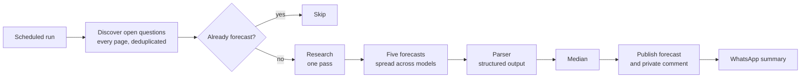

# Metaculus forecasting agent

An LLM agent that forecasts real questions on [Metaculus](https://www.metaculus.com/) without anyone watching it. It runs on GitHub Actions several times a day, finds new questions in the AI forecasting tournaments, researches them, asks several models for a forecast, combines the answers and publishes the result with a private comment explaining its reasoning.

It started from the official [Metaculus bot template](https://github.com/Metaculus/metac-bot-template). The template gets a bot to forecast once. Almost everything in this repository exists because running it unattended for weeks broke in ways the template does not handle: providers going down, questions that never got seen, forecasts leaking into public logs, a run that posts twice. The original template instructions are kept in [docs/template-guide.md](docs/template-guide.md).

## Where it competes

| Tournament | Id | Prizes for bots | Runs |
|---|---|---|---|
| [Fall 2026 FutureEval](https://www.metaculus.com/tournament/fall-futureeval-2026/) | 33121 | Yes, $50k season | Every scheduled run |
| MiniBench (rotates every two weeks) | `minibench` | Yes, $1k per round | Every scheduled run |
| [Metaculus Cup Fall 2026](https://www.metaculus.com/tournament/metaculus-cup-fall-2026/) | 33108 | No, practice against human forecasters | After each run, new questions only |

The ids live in one file, [`tournaments.py`](tournaments.py). CI fails on the day a pinned season ends, so the bot can't keep polling a finished tournament without anyone noticing. That happened once, for three days.

## Results so far

Summer 2026 FutureEval was its first season. Prizes have not been announced yet, so these figures are provisional (read on 2 October 2026):

| | |
|---|---|
| Final position | **88th of 192 bots** |
| Total score | +5.3 (the winner scored 5,815) |
| Predictions published | 229, with 100 comments |

The score is positive but small, and the reason is coverage rather than accuracy. The tournament score is a sum over questions, and a question the bot never sees counts as zero. On 18 August the bot had forecast 1 of 333 questions. Most of the work since then went into seeing more of them: paginated discovery, a polling loop inside each run, and measuring how often GitHub really delivers a scheduled run (about six times a day, not every five minutes; see [docs/cadence.md](docs/cadence.md)).

Brier and log scores on resolved questions are not published here yet. The [evaluation lab](docs/track-record.md) computes them, and they will go in this table once enough questions resolve to say something.

## How a question flows through it



Each forecast call goes into a chain: if its model fails, the call falls through to the next provider instead of failing the question.

| Role | Primary | Falls back to |
|---|---|---|
| Forecaster (five calls) | Spread across Claude Opus 4.6, Claude Haiku 4.5, Gemini Flash Lite and gpt oss 120b on Groq | The other models in the same order |
| Research and summary | Claude Haiku 4.5 | Gemini, then Groq |
| Parser | gpt 4o mini | Models verified to return structured JSON |

Why five calls over different models and not one model five times: averaging five samples of the same model keeps its blind spots. Mixing models is what FutureSearch, one of the top bots, describes doing, and the cheaper models keep a question well under the cost of five Opus calls.

## What it adds to the template

| Problem | What the template does | What this repository does |
|---|---|---|
| A provider is down or rate limited | The question fails | [`FallbackLlm`](backtest/fallback_llm.py) moves to the next provider; [`BalancedLlm`](backtest/balanced_llm.py) spreads the five calls; a sliding window limiter per model waits instead of erroring |
| A run retries after a network error | Can post a second forecast or comment | [`publication.py`](publication.py) allows one forecast per question and one comment per post, retries the comment past the SDK's budget and names it if it still fails ([docs/publication.md](docs/publication.md)) |
| More than 100 open questions | The SDK reads only the first page | [`discovery.py`](discovery.py) reads every page and deduplicates by question |
| Two `asyncio.run()` calls in one process | The template's semaphore breaks on the second loop | The limiter is rebuilt for each event loop |
| Public repository, public Actions logs | Forecasts for open questions end up in the logs | Three layers of log redaction, because the rules forbid previewing forecasts on open questions |
| Is a change actually better? | No way to tell | A read only [evaluation lab](docs/track-record.md) that works on the bot's own closed questions only and computes coverage, Brier and log score |
| Is the bot even running? | You check by hand | A WhatsApp message when it forecasts something new, and another one if the workflow fails |
| Seasons rotate | Ids come from SDK constants that only move when the SDK is upgraded | Ids pinned in [`tournaments.py`](tournaments.py), with a dated test that fails when a season ends |

## Rules it follows

The tournament has rules for bots, and the parts that matter are enforced in code and checked by tests in [`tests/test_tournament_eligibility.py`](tests/test_tournament_eligibility.py):

* No human in the loop. Nothing in the pipeline waits for a person, and the scored tournaments never get a question forecast twice.
* Every forecast carries a comment, and comments are always private. Metaculus makes them public on its own schedule.
* No previewing. The evaluation lab reads closed questions only; reading open ones needs an explicit flag that no workflow passes.

## Running the tests

```bash
poetry install
poetry run python -m unittest discover -s tests -t .
```

652 tests, 2 of them skipped because they need a real API key. CI runs them on Python 3.11 and 3.12 with no secrets at all, and every workflow runs with read only repository permissions.

## Known limits

Being upfront about these, because they are the next things to fix:

* **Research has no live search.** The researcher is a model working from its own knowledge, so recent news can be missing. Adding AskNews (free for tournament participants) is the next change.
* **No forecasting quality claims yet.** The work so far is about reliability and coverage. Prompts, aggregation and calibration are close to the template's, and there is no measured Brier yet to show an improvement.
* **Detection is limited by GitHub's scheduler.** Cron asks for a run every five minutes and gets about six a day. A polling window inside each run helps; an external trigger would help more.
* **Models are pinned by rewriting `main.py` in CI** ([`backtest/pin_models.py`](backtest/pin_models.py)). It works and is tested, but configuring them at runtime would be cleaner.

## Repository map

| Path | What it is |
|---|---|
| [`main.py`](main.py) | The bot: research, forecasting prompts per question type, entry point |
| [`tournaments.py`](tournaments.py) | Which tournaments it forecasts on |
| [`publication.py`](publication.py), [`discovery.py`](discovery.py) | Safe publishing and complete discovery |
| [`backtest/`](backtest/) | Model routing: fallback chains, ensemble, rate limiter, model pinning |
| [`research/`](research/) | Offline evaluation lab (read only) |
| [`notifications/`](notifications/) | WhatsApp run summaries |
| [`docs/`](docs/) | Design notes: [cadence](docs/cadence.md), [publication](docs/publication.md), [track record](docs/track-record.md), [template guide](docs/template-guide.md) |

## Credits

Built on the [Metaculus bot template](https://github.com/Metaculus/metac-bot-template) and the [forecasting tools](https://github.com/Metaculus/forecasting-tools) package by Metaculus. The upstream template has no license file, so the template code remains theirs; the modules listed above are my own work.
